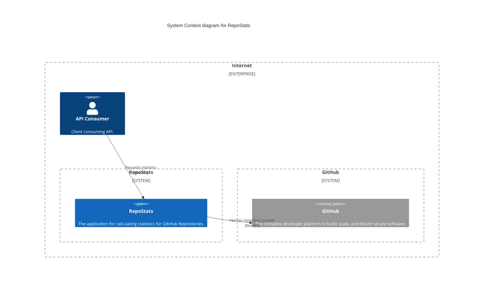
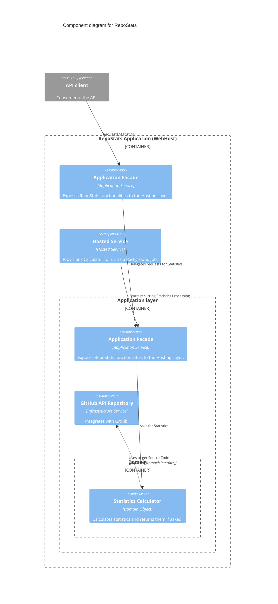

    Example appilcation with basic GitHub integration


# Project status

[](https://github.com/damikulik/RepoStats/actions/workflows/dotnet.yml)

# How to run and test

There is an `GitHub API` secret which must be set.

| Project | Key |
| -- | -- |
| App | `RepoStats:GitHubLoader:SecurityKey` |
| IntegrationTests | `SecurityKey` |

# API

## Letter occurence Statistics
```
    GET /letter-occurences/

    Returns: 200, 429, 503
    Formatting: application/json
```

# Architecture
Solution uses a simple DDD with Clean Architecture-like approach.

## System Context



## Container diagram
Same as System.

## Component diagram



## Main features

* Calculator is used by Hosted Service which runs periodically.
* API returns 503 if there is no Statistics calculated yet.

# Statistics Calculator details

Calculator takes advantage of Parallel processing and although Character count is a classic Map-Reduce case it is more optimal to use modified algorythm to produce Statistics in this case.

## Implementation debate
Few implementations of the Calculator are provided to select the most performant

* Naive
* MapReduce
* DirectReduce
* ConcurrentDirectReduce (baseline, used implementation)

## Benchmart Results

```

BenchmarkDotNet v0.14.0, Windows 10 (10.0.19045.5011/22H2/2022Update)
Intel Core i9-10885H CPU 2.40GHz, 1 CPU, 16 logical and 8 physical cores
.NET SDK 8.0.400
  [Host]     : .NET 8.0.8 (8.0.824.36612), X64 RyuJIT AVX2
  DefaultJob : .NET 8.0.8 (8.0.824.36612), X64 RyuJIT AVX2


```
| Method       | RepositoryFiles | Mean        | Error     | StdDev     | Ratio | RatioSD | Completed Work Items | Lock Contentions | Gen0      | Gen1      | Gen2     | Allocated | Alloc Ratio |
|------------- |---------------- |------------:|----------:|-----------:|------:|--------:|---------------------:|-----------------:|----------:|----------:|---------:|----------:|------------:|
| **Current**      | **1**               |    **92.36 ms** |  **1.844 ms** |   **5.350 ms** |  **1.00** |    **0.08** |               **4.0000** |                **-** | **2666.6667** |         **-** |        **-** |  **23.12 MB** |        **1.00** |
| DirectReduce | 1               |    79.63 ms |  1.599 ms |   4.689 ms |  0.87 |    0.07 |               2.0000 |                - | 2714.2857 |         - |        - |  23.09 MB |        1.00 |
| MapReduce    | 1               |    66.73 ms |  1.773 ms |   5.144 ms |  0.72 |    0.07 |               2.0000 |                - | 1428.5714 |  428.5714 | 285.7143 |  13.26 MB |        0.57 |
| Naive        | 1               |    67.16 ms |  1.679 ms |   4.950 ms |  0.73 |    0.07 |               2.0000 |                - | 1285.7143 |  285.7143 | 142.8571 |  13.25 MB |        0.57 |
|              |                 |             |           |            |       |         |                      |                  |           |           |          |           |             |
| **Current**      | **100**             |   **333.37 ms** |  **6.612 ms** |  **12.419 ms** |  **1.00** |    **0.05** |             **118.0000** |          **21.0000** | **3000.0000** |         **-** |        **-** |  **27.68 MB** |        **1.00** |
| DirectReduce | 100             | 4,722.80 ms | 93.819 ms | 137.518 ms | 14.19 |    0.66 |             101.0000 |                - | 3000.0000 |         - |        - |  28.33 MB |        1.02 |
| MapReduce    | 100             | 4,734.67 ms | 92.943 ms |  99.448 ms | 14.22 |    0.60 |             101.0000 |                - | 2000.0000 |         - |        - |   17.6 MB |        0.64 |
| Naive        | 100             | 4,699.95 ms | 92.016 ms | 131.967 ms | 14.12 |    0.65 |             101.0000 |                - | 2000.0000 | 1000.0000 |        - |  17.59 MB |        0.64 |
# Future work

1. Per file stats calculation could be added to avoid recalculating Stats for files which did not change.
2. Implementation of the Web hooks would be more optimal, especially in combination with #1.  
   Combining it with a simple data store would help with optimizaiton of Repository usage.
3. With minimal changes:
    * more repositories can be supported
    * more Calculators can be added
    * configuration could be provided to control things like Character or Case Sensitivity
    * allow different type of filters besides programming language
4. It is a good example of App which could be hosted as a Function App, it would require addition of simple Storage model though.
5. Bigger repositories would most probably require another approach to obtain the list of the files matching the search criteria.
6. Separate IntegrationTests Action run and make it time-based or pre-release based.
